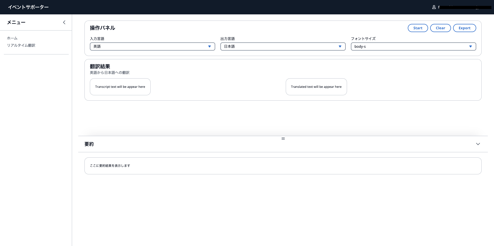

# Event Support AI（イベント支援AIツール集）

イベント開催を支援するためのAIツール集を提供するプロジェクトです。リアルタイム翻訳や音声要約など、イベント運営に役立つ機能を実装しています。

[](https://opensource.org/licenses/MIT)

## 目次

- [機能紹介](#機能紹介)
- [システム構成](#システム構成)
- [前提条件](#前提条件)
- [インストール方法](#インストール方法)
- [設定方法](#設定方法)
- [使用方法](#使用方法)
- [貢献方法](#貢献方法)
- [ライセンス](#ライセンス)

## 機能紹介

### リアルタイム翻訳



- 日本語から英語、英語から日本語など、設定した言語でニアリアルタイムに翻訳
- Amazon Transcribeによる音声の文字起こし
- Amazon Translateによる逐次翻訳
- 直近の話題についてAI要約機能（Amazon Bedrock Claude使用）

### 使用シナリオ

- 国際会議やイベントでのリアルタイム翻訳
- オンライン配信の多言語対応
- 動画コンテンツの翻訳（`BlackHole2`などを利用）

> **注意**: 逐次翻訳のためAmazon TranslateのAPIを高頻度で実行します。AWS利用料金にご注意ください。

## システム構成

- **フロントエンド**: React + TypeScript + Vite
- **バックエンド**: AWS CDK で構築されたサーバーレスアーキテクチャ
- **AWS サービス**:
  - Amazon Cognito：認証
  - Amazon Transcribe：音声文字起こし
  - Amazon Translate：翻訳
  - Amazon Bedrock：要約生成（Claude）
  - AWS WAF：アクセス制限

## 前提条件

- Node.js 18.x以上
- npm 9.x以上
- AWS CLI（設定済み）
- AWS CDK v2
- AWS アカウント（必要なサービスへのアクセス権限付き）

## インストール方法

1. リポジトリのクローン:

```bash
git clone https://github.com/fsatsuki/event_support_ai.git
cd event_support_ai
```

2. 依存パッケージのインストール:

```bash
npm ci
```

## 設定方法

### CDKの設定変更

`packages/cdk/cdk.json` を構築する環境に合わせて設定値を編集します:

|設定値| 意味 | デフォルト値|
|----|-----|-----|
|selfSignUpEnabled| Amazon Cognitoのセルフサインアップを有効化する| true|
|allowedSignUpEmailDomains|Amazon Cognitoにサインアップ可能なメールのドメインを設定する| amazon.co.jp|
|modelRegion| Amazon Bedrockのモデルを使用するリージョンを選択| us-east-1|
|modelIds| 要約で使用するAmazon Bedrockのモデルを設定する | anthropic.claude-3-sonnet-20240229-v1:0|
|allowedIpV4AddressRanges| AWS WAFに設定するIPアドレスによる制限。リスト形式で列挙する。無効化する場合はnullを設定する。|null|
|allowedIpV6AddressRanges| AWS WAFに設定するIPアドレスによる制限。リスト形式で列挙する。無効化する場合はnullを設定する。|null|
|allowedCountryCodes| AWS WAFに設定する地理的一致ルールステートメント| ["JP"]

### 音声入出力の設定

パソコンの音声出力をアプリの入力に渡すには、`BlackHole2`などの仮想オーディオデバイスを使用します：


## 使用方法

1. CDKのデプロイ:

```bash
npm run cdk:deploy
```

2. フロントエンドの開発環境実行:

```bash
npm run web:dev
```

3. フロントエンドのビルド:

```bash
npm run web:build
```

## 貢献方法

1. このリポジトリをフォーク
2. 新しいブランチを作成 (`git checkout -b feature/amazing-feature`)
3. 変更をコミット (`git commit -m 'Add amazing feature'`)
4. ブランチをプッシュ (`git push origin feature/amazing-feature`)
5. Pull Requestを作成

## ライセンス

このプロジェクトはMITライセンスの下で公開されています。詳細は[LICENSE](LICENSE)ファイルをご覧ください。